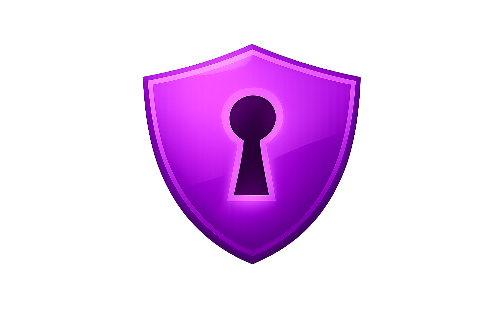

<p align="center">
  
</p>

# kdguard

[](https://www.rust-lang.org/)
[](https://github.com/KarnesTH/kdguard/releases/latest)
[](https://github.com/KarnesTH/kdguard/actions)
[](LICENSE)
[](https://github.com/KarnesTH/kdguard/releases)

A CLI tool to generate secure and random passwords.

## Features

- **Random Password Generation** - Generate secure passwords with customizable length (8-64 characters)
- **Pattern-Based Passwords** - Create passwords following custom patterns (U=Uppercase, L=Lowercase, D=Digits, S=Special)
- **Passphrase Generation** - Generate memorable passphrases using Diceware wordlists (German/English, 3-20 words)
- **Deterministic Passwords** - Generate service-specific passwords from a master seed using HKDF
- **Password Health Check** - Analyze password strength with comprehensive scoring system
- Generate multiple passwords at once
- Save passwords to files with timestamps
- Cryptographically secure random number generation (ring library)
- Password validation ensuring lowercase, uppercase, digits, and special characters
- Multi-language support (English/German)

## Installation

### Using install script (Linux/macOS)

```bash
curl -LsSf https://raw.githubusercontent.com/KarnesTH/kdguard/main/install.sh | sh
```

### Using install script (Windows PowerShell)

```powershell
powershell -ExecutionPolicy ByPass -c "irm https://raw.githubusercontent.com/KarnesTH/kdguard/main/install.ps1 | iex"
```

### Manual installation

Download the latest binary from [GitHub Releases](https://github.com/KarnesTH/kdguard/releases) for your platform.

## Examples

### Random Password Generation

```bash
# Generate a single password (default length: 16)
kdguard

# Generate password with custom length
kdguard -l 20

# Generate multiple passwords
kdguard -c 5

# Generate and save passwords
kdguard -l 24 -c 3 -s -o passwords.txt
```

### Pattern-Based Passwords

```bash
# Generate password following pattern: Uppercase, Lowercase, Digit, Digit
kdguard -m pattern -p "ULLDD"

# Pattern: U=Uppercase, L=Lowercase, D=Digit, S=Special
kdguard -m pattern -p "ULLDSS"
```

### Passphrase Generation

```bash
# Generate 5-word passphrase (German wordlist)
kdguard -m phrase -w 5

# Generate 7-word passphrase (uses language from config)
kdguard -m phrase -w 7
```

### Deterministic Password Generation

```bash
# Set master seed in environment variable
export PASSGEN_SEED="your-master-seed"

# Generate password for GitHub service
kdguard -m deterministic --seed-env PASSGEN_SEED --service github

# Generate password with custom salt
kdguard -m deterministic --seed-env PASSGEN_SEED --service github --salt custom-salt
```

### Password Health Check

```bash
# Check password strength
kdguard check 'YourPassword123!'

# Detailed analysis with score breakdown
kdguard check 'YourPassword123!' --detailed
```

**Note:** When checking passwords with special characters like `$`, `!`, `(`, `)`, use single quotes (`'`) to prevent shell interpretation.

## Password Generation Modes

### Random Mode (Default)

Generates cryptographically secure random passwords with customizable length. Ensures all character types are present.

**Options:**
- `-m random` or default mode
- `-l, --length <LENGTH>` - Password length (8-64 characters)

### Pattern Mode

Generate passwords following a custom pattern where each character position is defined.

**Pattern Characters:**
- `U` - Uppercase letter
- `L` - Lowercase letter
- `D` - Digit
- `S` - Special character

**Options:**
- `-m pattern` - Enable pattern mode
- `-p, --pattern <PATTERN>` - Pattern string (e.g., "ULLDSS")

**Example:** `kdguard -m pattern -p "ULLDSS"` generates a 6-character password with uppercase, lowercase, lowercase, digit, special, special.

### Phrase Mode

Generate memorable passphrases using Diceware wordlists. Words are separated by hyphens.

**Features:**
- Uses 7,776-word Diceware lists (German/English)
- Language selection based on config setting
- Words are randomly selected from the wordlist

**Options:**
- `-m phrase` - Enable phrase mode
- `-w, --words <COUNT>` - Number of words (3-20)

**Example:** `kdguard -m phrase -w 5` generates a 5-word passphrase like `abend-abbruch-abfahrt-abfallen-abfangen`.

### Deterministic Mode

Generate service-specific passwords from a master seed using HKDF (HMAC-based Key Derivation Function). Same seed + same service = same password.

**Features:**
- Always generates 20-character passwords
- Uses HKDF for secure key derivation
- Service-specific passwords from single master seed
- Optional salt for additional entropy

**Options:**
- `-m deterministic` - Enable deterministic mode
- `--seed-env <VAR>` - Environment variable containing the master seed (required)
- `--service <SERVICE>` - Service name (e.g., "github", "gitlab")
- `--salt <SALT>` - Optional custom salt

**Example:**
```bash
export PASSGEN_SEED="my-secret-master-seed"
kdguard -m deterministic --seed-env PASSGEN_SEED --service github
# Always generates the same password for GitHub

kdguard -m deterministic --seed-env PASSGEN_SEED --service gitlab
# Generates a different password for GitLab
```

## Password Health Check

The `check` command analyzes passwords using a comprehensive scoring system:

- **Score Range:** 0-100 points
- **Rating Levels:**
  - Weak (0-40 points)
  - Medium (41-60 points)
  - Strong (61-80 points)
  - Very Strong (81-100 points)

### Scoring Categories

1. **Length Score (0-25 points):** Based on password length
2. **Character Diversity Score (0-30 points):** Checks for lowercase, uppercase, digits, and special characters
3. **Complexity Score (0-25 points):** Detects common patterns and repetitions
4. **Entropy Score (0-20 points):** Measures password entropy based on character set size

### Features

- Checks against 10,000 most common passwords
- Detects common patterns (sequences, keyboard patterns)
- Identifies character repetitions
- Provides actionable improvement suggestions

**Usage:**
- `kdguard check <PASSWORD>` - Basic strength check
- `kdguard check <PASSWORD> --detailed` - Detailed analysis with score breakdown

## Building from source

**Prerequisites:** You need to have [Rust](https://www.rust-lang.org/tools/install) installed.

```bash
git clone https://github.com/KarnesTH/kdguard.git
cd kdguard
cargo build --release
```

## License

MIT License - see [LICENSE](LICENSE) file for details.

## Author

Developed with ❤️ by KarnesTH

